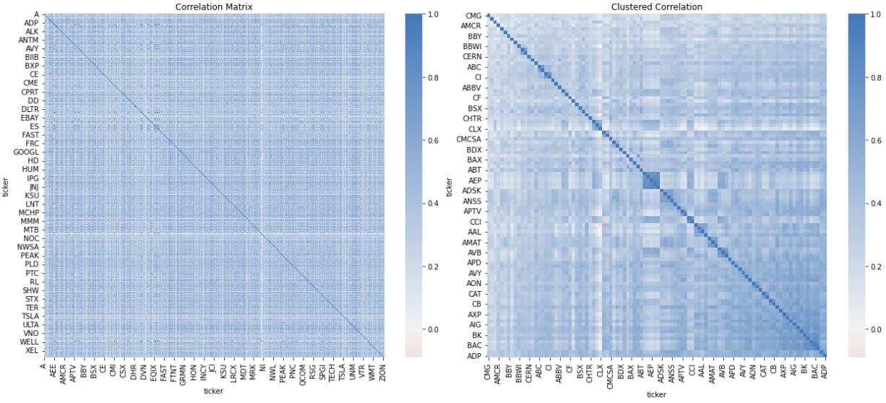
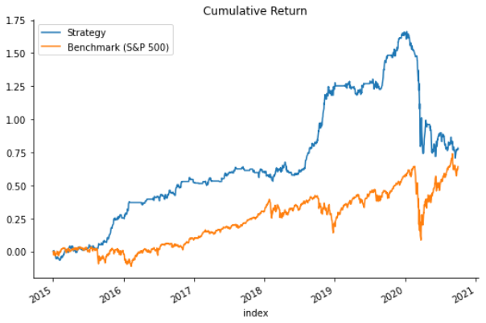

# Algorithmic Trading using Machine Learning

This repository contains the source code for a Python Project which aims at studying different machine learning models and applying them in the domain of algorithmic trading.

It also includes screeners for identifying potential stocks and backtesting strategies for each model. An online learning model is also prepared to be used during live trading.

## Getting Started

All of the functions are implemented in Jupyter Notebooks.

### Prerequisites

* Anaconda Navigator (preferred)
* yFinance
* TA-Lib
* Backtrader
* PyFolio

### Installing

Open the Anaconda Prompt and install the additional libraries using:

```
pip install yfinance
conda install -c conda-forge ta-lib
pip install backtrader
conda install -c conda-forge pyfolio
```

And, we're good to go!

## Deployment

#### Data

The notebook **00_Data.ipynb** loads the required fundamental and market data for S&P500 stocks using Yahoo Finance and stores them in the directory */data*.

The notebook **01_Screener.ipynb** screens for momentum and value stocks based on the downloaded data.

The notebook **02_FeatureEngineering.ipynb** creates financial features from the data and accomodates technical and factor data to the dataset. The dataset is cleaned and categorical variables are encoded as well.

Returns for holding periods of 1,5,10,21,42 and 63 days are added as target variables and stored in */data/featureset.csv*.

#### Training

The notebook **03_LinearModels.ipynb** applies Ridge Regression and Logistic Regression to predict returns/market movements.

The notebook **04_TimeSeries.ipynb** decomposes the series, makes it stationary and applies ARMA and VAR to predict returns.



The notebook **05_UnsupervisedLearning.ipynb** applies PCA on the engineered features to extract the best 30 principal components (*/data/pcafeatureset.csv*). Further, PCA and Hierarchial Clustering are used to obtain weights for a bag of selected 100 stocks.

The notebook **06_BoostingMethods.ipynb** uses the PCA extracted features to train XGBoost, LightGBM and CatBoost models to predict returns/market movements.

All predictions are stored as CSVs in the directory */predictions*.

#### Backtesting



The notebook **07_Backtesting.ipynb** uses Backtrader to backtest the predictions for all the trading models. Further analysis is done using PyFolio.

The notebook **08_OnlineModel.ipynb** trains an online learning K-Nearest Neighbors model along with backtesting.

The file **helpers.py** contains helper functions for calculation and visualisation.

## Built With

* [Anaconda Navigator](https://www.anaconda.com/products/individual) - Python Distribution
* [yFinance](https://github.com/ranaroussi/yfinance) - Data Loader
* [TA-Lib](https://www.ta-lib.org/) - Technical Analysis Library
* [Backtrader](https://www.backtrader.com/) - Backtesting Framework
* [PyFolio](https://quantopian.github.io/pyfolio/) - Performace/Risk Evaluation Library

## Authors

* **Ishan Bhattacharya** - *Initial work* - [ishanbhattacharya](https://github.com/ishanbhattacharya)
* *References* - Machine Learning for Algorithmic Trading (2nd Edition), Stefan Jansen

See also the list of [contributors](https://github.com/ishanbhattacharya/sentiment-analysis-toolkit/contributors) who participated in this project.
